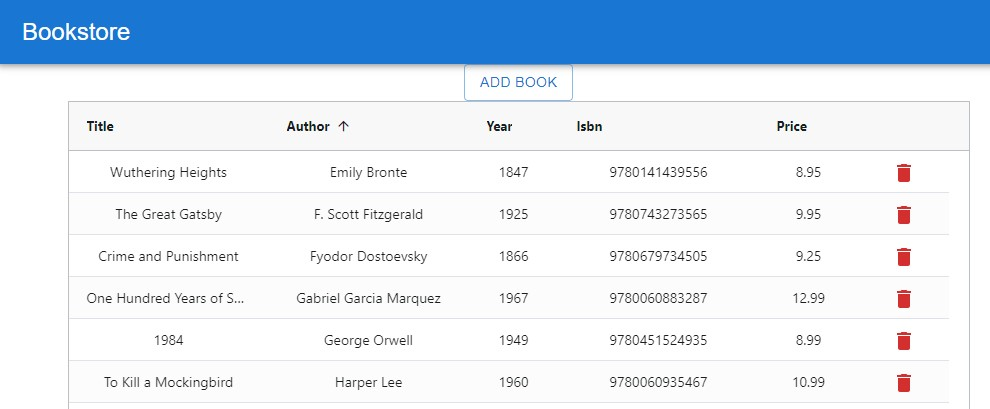

🔔 🔔 🔔
---
## About the project

This is **bookstore** project as part of the "Metropolia UAS REACT.JS FUNDAMENTALS' course. The project aims to introduce the fundamental concepts of React.js and provide hands-on experience with building a React application.

## Task description

Create the Firebase project that is called bookstore. Create realtime database and import the following data. You can copy the data into the json file and import that.

```
{
"books" : {
  "-MGvq69vFRNAi6N4RPPf" : {
    "title" : "Anna Karenina",
    "author" : "Leo Tolstoy",
    "year" : "1877",
    "isbn" : "9780140864854",
    "price" : "13.5"
  },
  "-MGvqCptPhR1BMdNN2IQ" : {
    "title" : "The Haunting of Hill House",
    "author" : "Shirley Jackson",
    "year" : "1992",
    "isbn" : "9780141191447",
    "price" : "9.75"
  }
 }
}

```

Create front end to your Firebase bookstore realtime database REST API. The user should be able to list all books (with sort and filtering), add new books and delete existing books.

The defaut view.




## Installation

1.Clone the repository or download the source code.

`git clone https://github.com/ElenaCoder/bookstore`

2.Install the dependencies.

`cd bookstore`
`npm install`


## Usage

1.Start the development server.

`npm start`

2.Open your web browser and navigate to http://localhost:3000 to view the React application.

## Project Structure
```
├── public
│   ├── index.html
├── src
│   ├── App.js
│   ├── App.css
│   ├── AddBook.js
│   └── ...
│   ├── index.js
│   └── ...
├── package.json
└── README.md
```

## License

This project is licensed under the MIT License - see the LICENSE file for details.


---